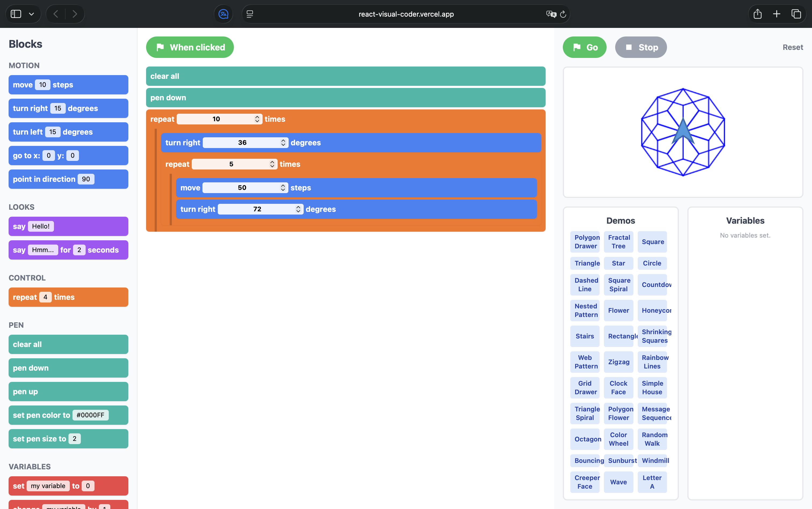

# React Scratch Logo 可视化编程

一个使用 React、TypeScript 和 Tailwind CSS 构建的，类似于 Scratch 的可视化编程应用。本项目提供了一个交互式的积木化编程环境，用户可以在其中创建脚本，控制舞台上的精灵（Sprite），绘制复杂的图案，并构建简单的动画。

## ✨核心功能

*   **积木面板**: 一个功能丰富的积木库，按功能分类（运动、外观、控制、画笔、变量）。
*   **拖拽式脚本区域**: 一个直观的画布，用户可以从积木面板中拖出积木，将它们拼接成脚本，并编辑其参数。
*   **实时舞台**: 一个可视化的舞台，精灵会在这里实时执行创建的脚本。舞台区包含 **运行 (Go)**、**停止 (Stop)** 和 **重置 (Reset)** 的控制按钮。
*   **画笔绘图**: 精灵配备了一支虚拟画笔，可以在移动时在舞台上绘制色彩丰富、错综复杂的形状、图案和分形。
*   **变量管理**: 用户可以创建、设置和修改变量，从而实现更复杂的逻辑，例如循环计数器或动态绘图值。
*   **流程控制**: 支持核心的控制结构，如 `重复执行` 积木，并且可以进行嵌套以创建复杂的循环和递归图案。
*   **丰富的示例库**: 内置了超过 30 个预设的示例脚本——从简单的多边形到精美的分形树——这些示例展示了应用的功能，并为用户提供了一个绝佳的起点。

## 🚀 技术栈

*   **React**: 用于通过组件化的架构构建用户界面。
*   **TypeScript**: 用于静态类型检查，提高代码质量和可维护性。
*   **Tailwind CSS**: 用于通过功能类优先的 CSS 框架快速构建样式。

## 🔧 如何使用

1.  **选择积木**: 浏览左侧的 **积木面板**，找到你需要的积木。
2.  **构建脚本**: 从面板中拖拽积木到中间的 **脚本区域**。它们会自动吸附并拼接在一起。
3.  **自定义参数**: 点击积木内的输入框来更改数值、选择颜色或使用变量。
4.  **运行代码**: 点击脚本上方的 **“当被点击时”** 按钮或舞台上的绿色 **“运行”** 旗帜，让你的脚本生动起来。
5.  **探索示例**: 不知道从哪里开始？点击 **示例** 面板中的任意按钮，加载一个预设的项目，看看它是如何工作的！
6.  **重置**: 点击舞台上的 **“重置”** 按钮，可以清除画布、重置精灵的位置并清空所有变量。
